# User Guide

## Table of Contents
1. [Login to admin dashboard](#Login-to-admin-dashboard)
2. [Vehicles](#Vehicles)   
  2.1 [Create a vehicle](#Create-a-vehicle)  
  2.2 [Edit a vehicle](#Edit-a-vehicle)  
  2.3 [Delete a vehicle](#Delete-a-vehicle)   
3. [Vehicle attributes](#Vehicle-attributes)  
  3.1 [Create an attribute](#Create-an-attribute)  
  3.2 [Edit an attribute](#Edit-an-attribute)  
  3.3 [Delete an attribute](#Delete-an-attribute)   
4. [Reservations](#Reservations)  
  4.1 [Create a reservation](#Create-a-reservation)  
  4.2 [Edit a reservation](#Edit-a-reservation)  
  4.3 [Delete a reservation](#Delete-a-reservation)
5. [Hires](#Hires)  
  5.1 [Create a hire](#Create-a-hire)  
  5.2 [Edit a hire](#Edit-a-hire)  
  5.3 [Delete a hire](#Delete-a-hire)     
6. [Users](#Users)  
  6.1 [Update info](#Update-info)  
  6.2 [Update password](#Update-password)  

## Login to admin dashboard
1. After completing the installation steps, navigate to http://homestead.test/login or http://www.kingdomhire.com/login in your browser

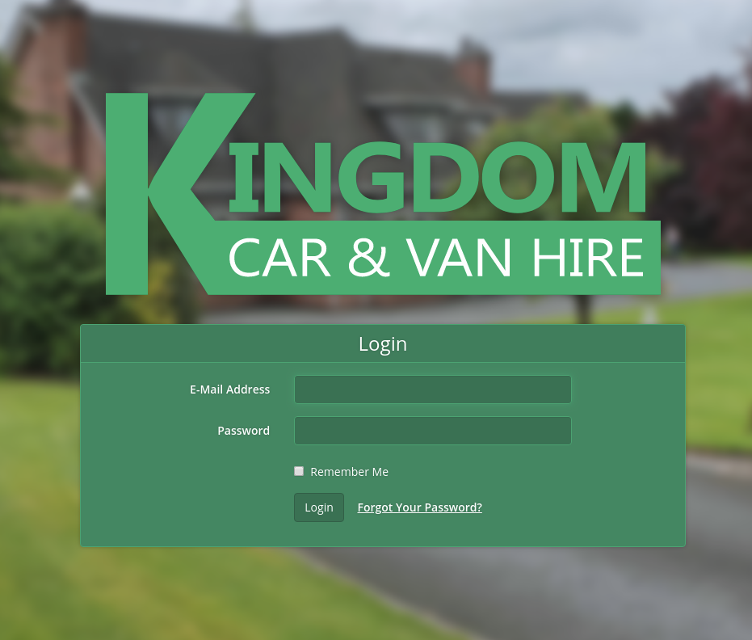

2. Input your email and password that you should have created with the `php artisan user:create` command

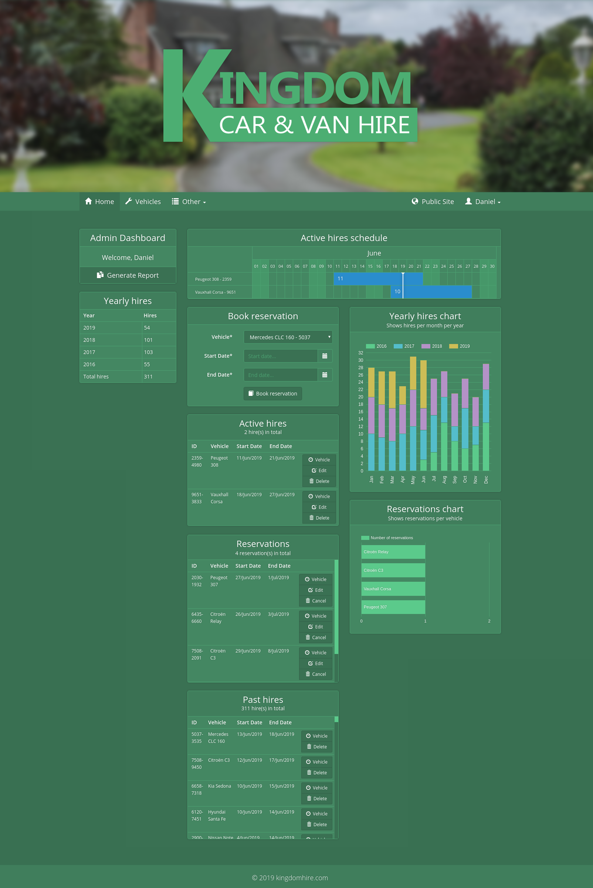

After logging in, you should be directed to the **admin dashboard** (http://homestead.test/admin or http://www.kingdomhire.com/admin). It should look similar to the above screenshot if you populated the application with the `php artisan migrate --seed` or `php artisan db:seed` command  

## Vehicles

1. Navigate to http://homestead.test/admin/vehicles or http://www.kingdomhire.com/admin/vehicles

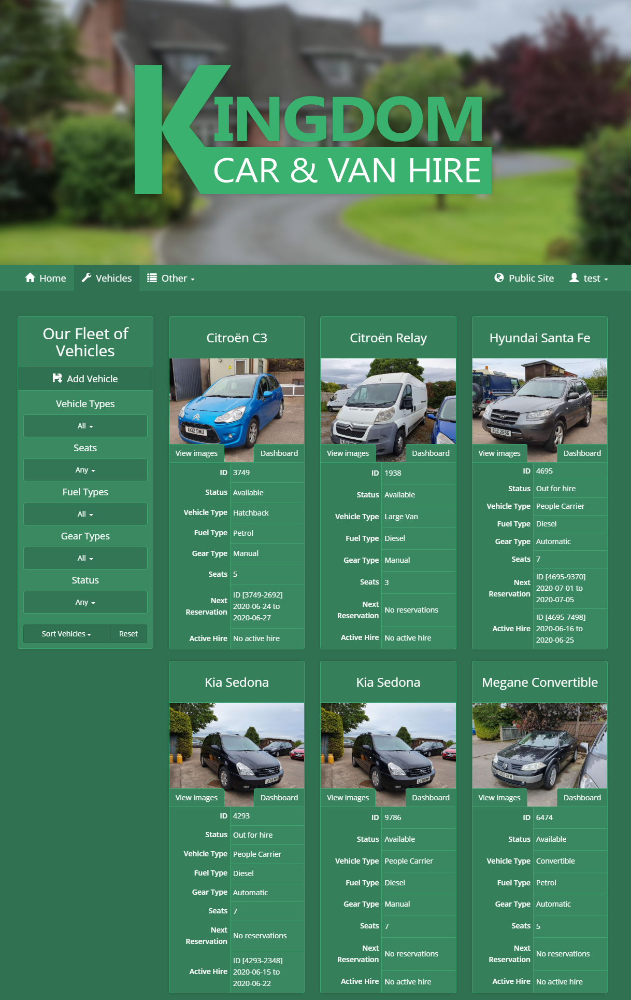

### Create a vehicle

1. Click on the `Add Vehicle` button on the vehicles page  
(Can also add a vehicle from the admin home page)

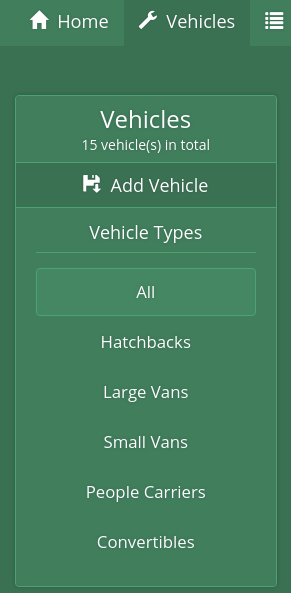
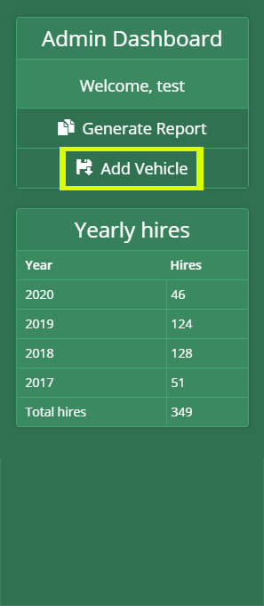

2. Fill out the form and click the `create` button

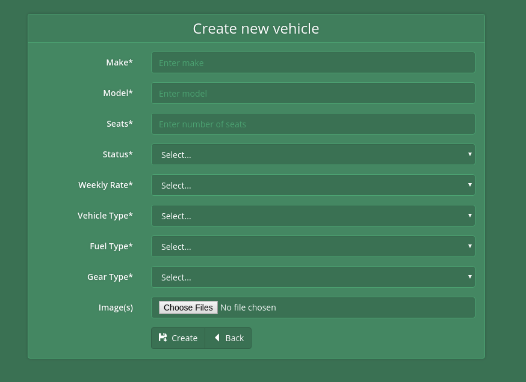

### Edit a vehicle

1. Click on the `dashboard` button for the vehicle you want to edit on the vehicles page

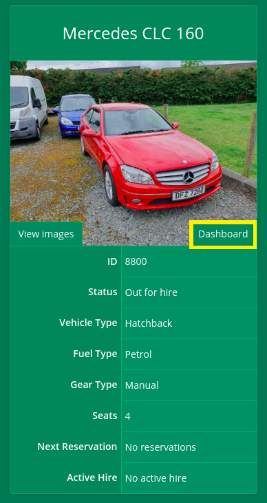

2. After going to the vehicle's dashboard, Click on the `edit` button

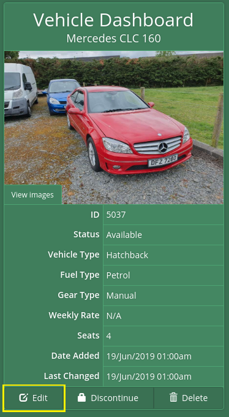

3. Make the changes you want to the vehicle, then click the `update` button

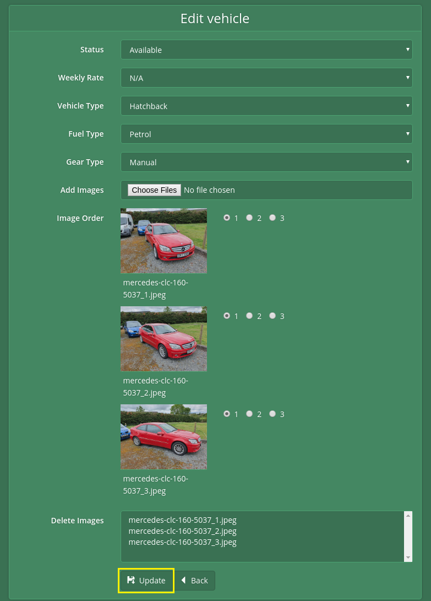

### Delete a vehicle

1. Click on the `dashboard` button for the vehicle you want to delete on the vehicles page

2. After going to the vehicle's dashboard, Click on the `delete` button to delete the vehicle

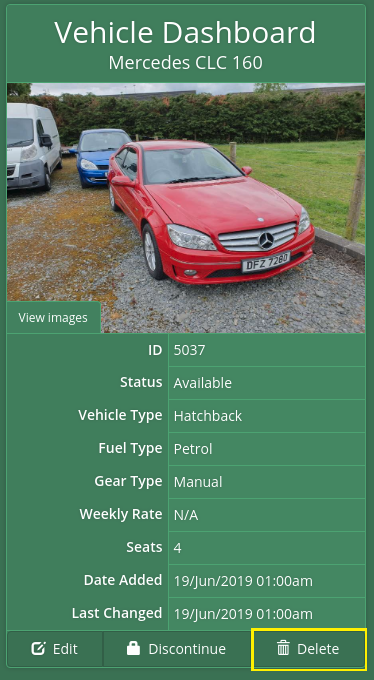

## Vehicle attributes

There are 4 vehicle attributes that are customisable: `weekly rates`, `vehicle types`, `fuel types` and `gear types`.

These attributes are available under the `Other` button in the navigation bar

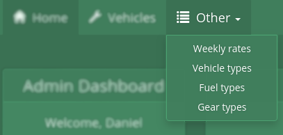

### Create an attribute

1. Go to the page for the attribute you want to create (Pages available under `Other` button in navigation bar)
2. Fill out the vehicle attribute form and click the `create` button

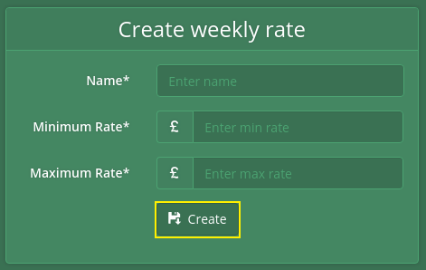

### Edit an attribute

1. Go to the page for the attribute you want to edit (Pages available under `Other` button in navigation bar)
2. Click the `edit` button for the vehicle attribute you want to edit

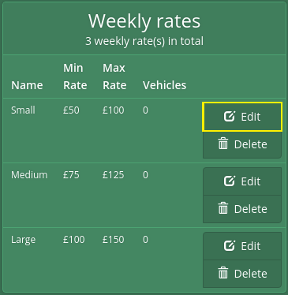

3. Fill out the edit form and click the `update` button

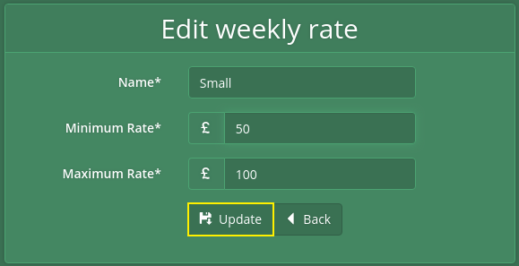

### Delete an attribute

1. Go to the page for the attribute you want to delete (Pages available under `Other` button in navigation bar)
2. Click the `delete` button for the vehicle attribute you want to delete

## Reservations

### Create a reservation

There are two ways you can book a reservation for a vehicle:

#### 1st method
1. Go to the administrator dashboard `home` page
2. Fill out the `book reservation` form and click the `book reservation` button

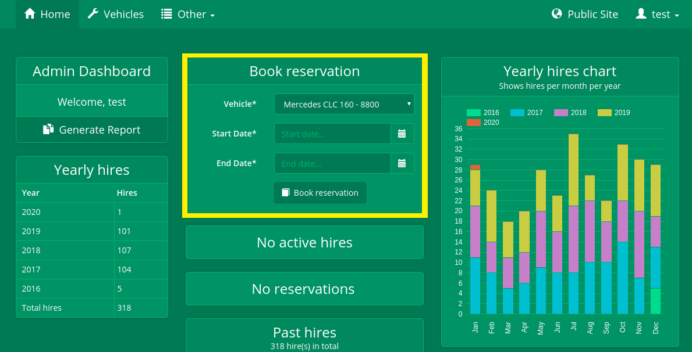

#### 2nd method
1. Go to the administrator dashboard `vehicles` page
2. Click the `dashboard` button of the vehicle you want to book a reservation for
3. Fill out the vehicles `book reservation` form and click the `book reservation` button

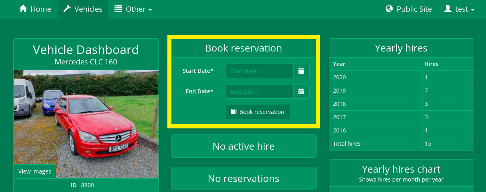

### Edit a reservation

There are two ways you can edit a reservation for a vehicle

#### 1st method
1. Go to the administrator dashboard `home` page
2. Find the reservation you want to edit in the `reservations` list
3. Click the `edit` button of the reservation you want to edit
4. Adjust the `start date` or `end date` values then click the `update` button

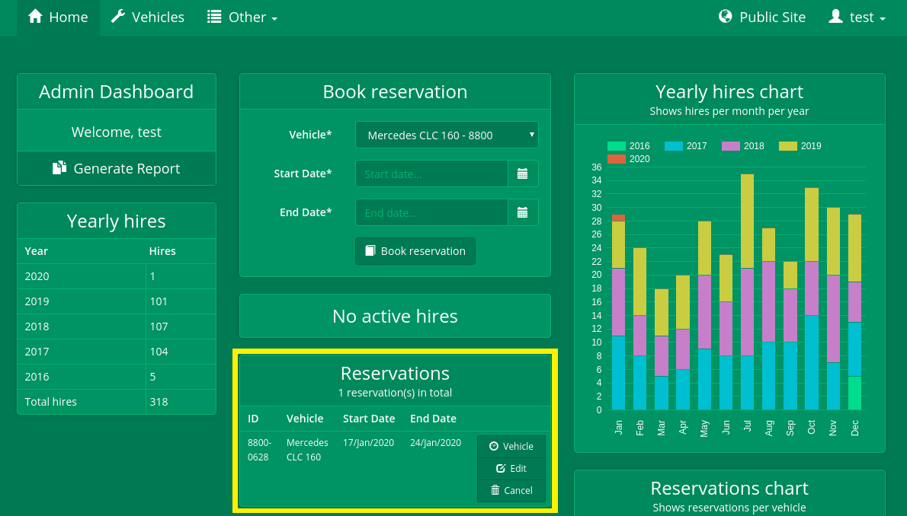

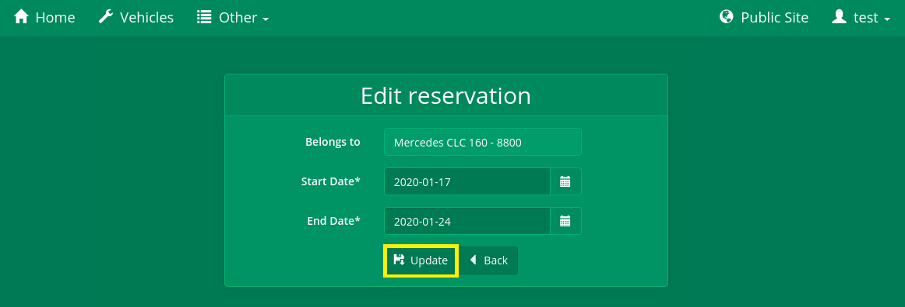

#### 2nd method
1. Go to the administrator dashboard `vehicles` page
2. Click the `dashboard` button of the vehicle you want to edit a reservation for
3. Find the reservation you want ot edit in the `reservations` list
4. Adjust the `start date` or `end date` values then click the `update` button

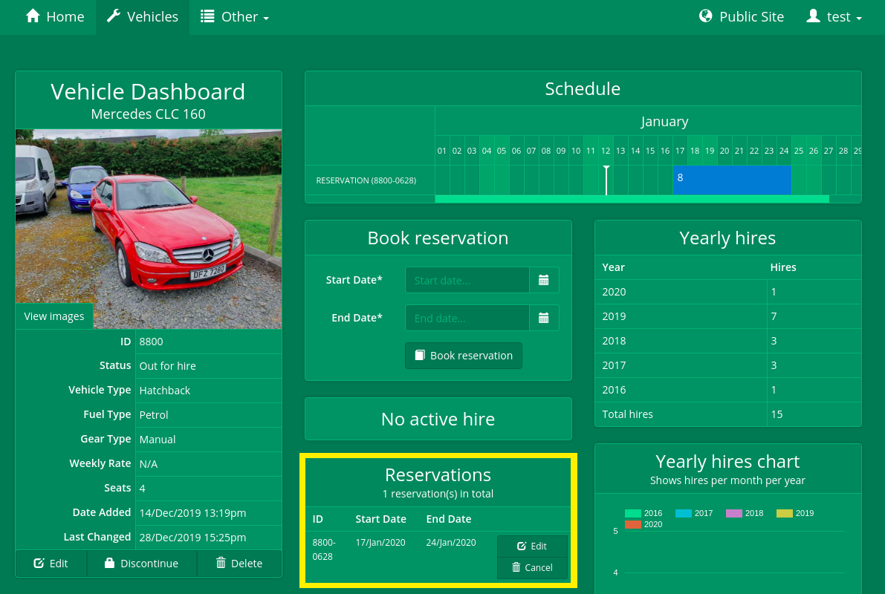

### Delete a reservation

There are two ways you can delete a reservation for a vehicle

#### 1st method
1. Go to the administrator dashboard `home` page
2. Find the reservation you want to delete in the `reservations` list
3. Click the `cancel` button of reservation you want to delete

#### 2nd method
1. Go to the administrator dashboard `vehicles` page
2. Click the `dashboard` button of the vehicle you want to delete a reservation for
3. Find the reservation you want ot delete in the `reservations` list
4. Click the `cancel` button of reservation you want to delete

## Hires

### Create a hire

Hires cannot be created directly, you can only create a hire when booking a reservation that has a `start date` equal to `todays date`

See the [Create a reservation](#Create-a-reservation) section to see how to do this

If the cron scheduler if running on the system, reservations will automatically be `converted` into hires if their `start date` is equal to or less than `todays date`

### Edit a hire

There are two types of hires `active` and `past` hires  
`active` hires can be edited, however `past` hires cannot be edited

There are two ways you can edit an `active` hire for a vehicle

#### 1st method
1. Go to the administrator dashboard `home` page
3. Click the `edit` button of the `active` hire
4. Adjust the `end date` value then click the `update` button

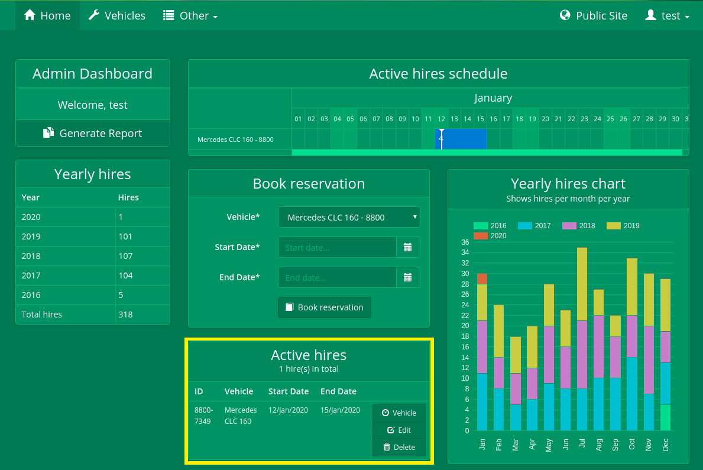

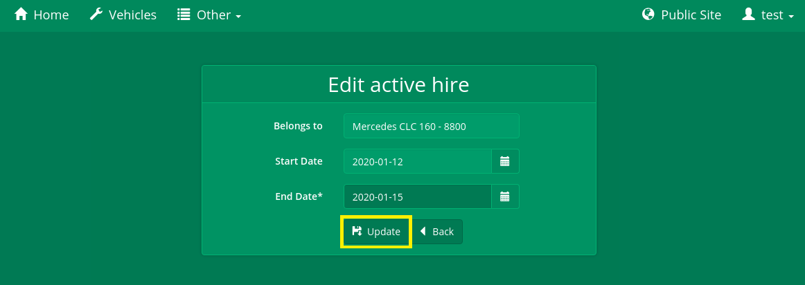

#### 2nd method
1. Go to the administrator dashboard `vehicles` page
2. Click the `dashboard` button of the vehicle you want to edit a hire for
3. Find the hire you want ot edit in the `hires` list
4. Adjust the `end date` value then click the `update` button

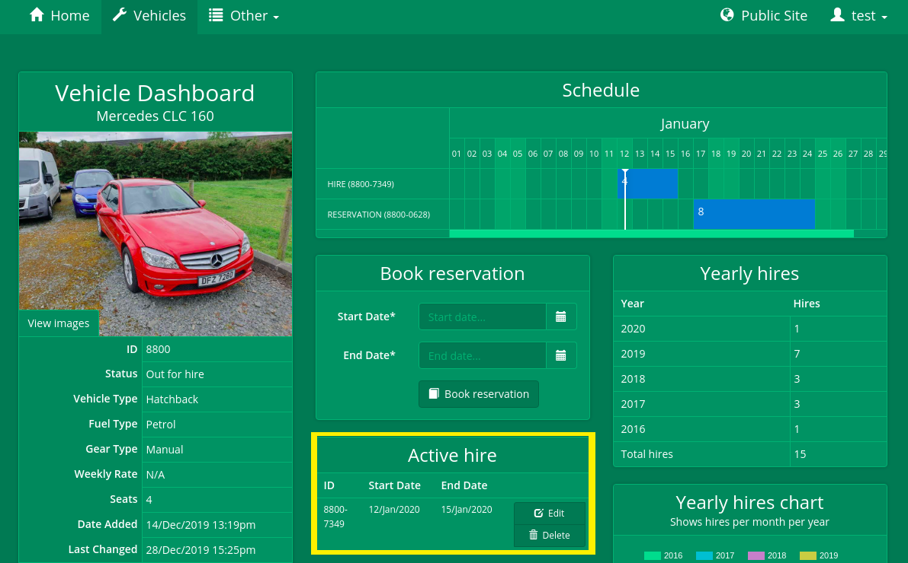

### Delete a hire

There are two ways you can delete a hire for a vehicle

You can delete both `active` and `past` hires

#### 1st method
1. Go to the administrator dashboard `home` page
3. Click the `delete` button of the hire you want to delete

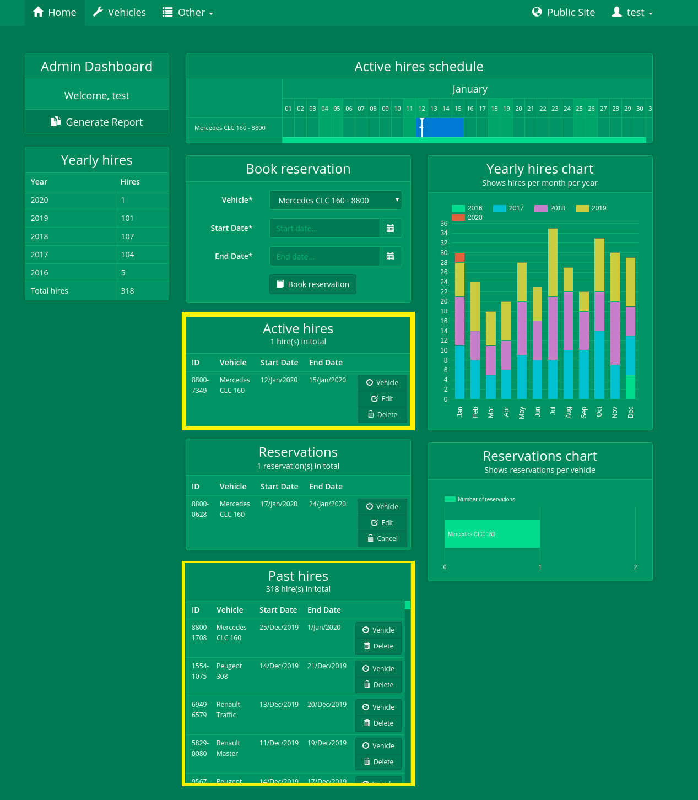

#### 2nd method
1. Go to the administrator dashboard `vehicles` page
2. Click the `dashboard` button of the vehicle you want to delete a hire for
3. Click the `delete` button of the hire you want to delete

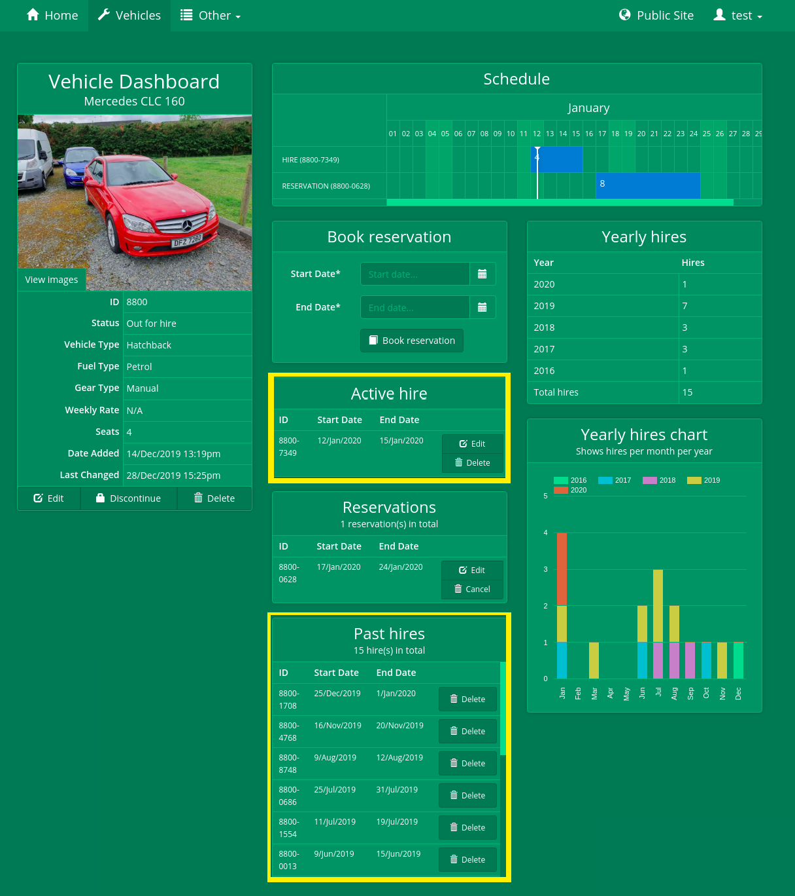

## Users

### Update info

1. Click the `user` button dropdown (It should be the name of the current logged in user)
2. Click the `update info` button
3. Update the values in the form and click the `update` button

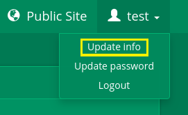

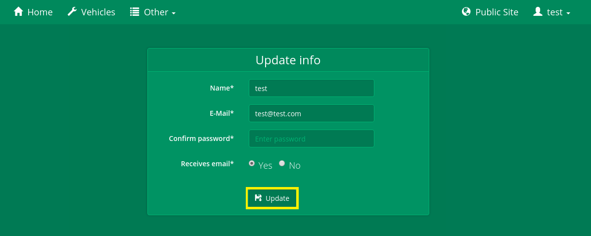

### Update password
1. Click the `user` button dropdown (It should be the name of the current logged in user)
2. Click the `update password` button
3. Update the values in the form and click the `update` button

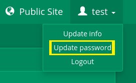

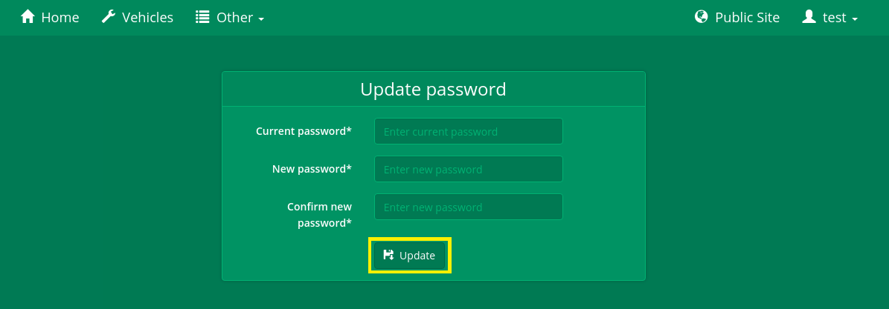