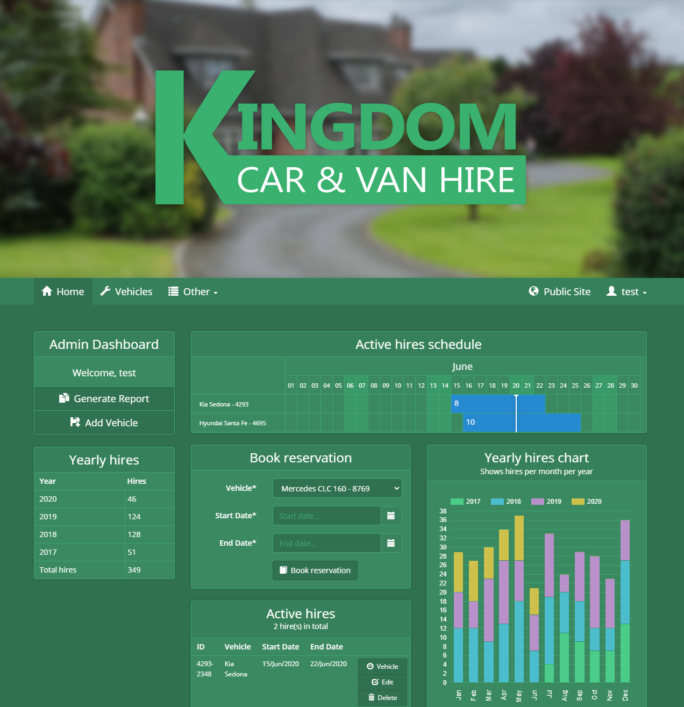
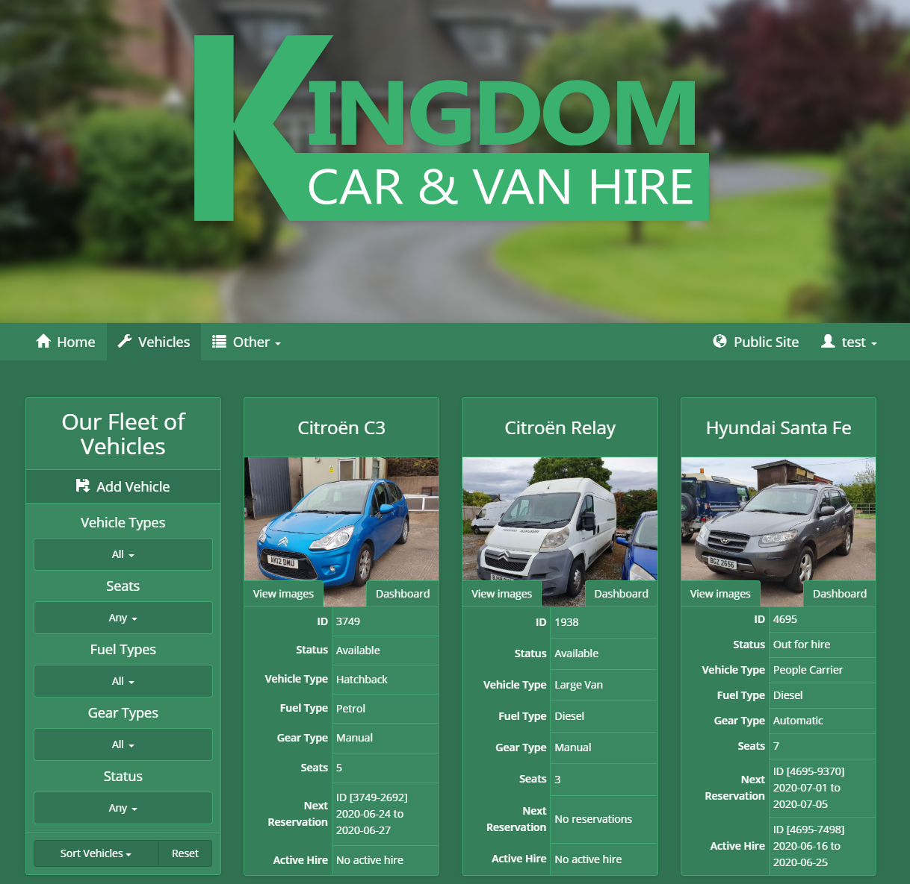
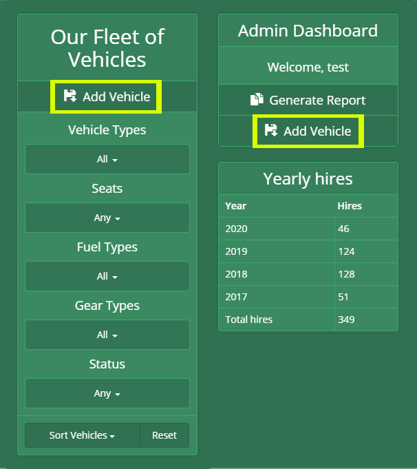
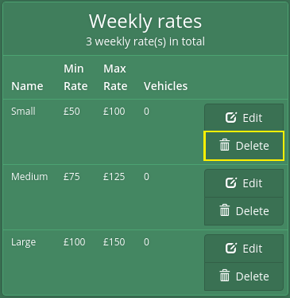

# User Guide

## Table of Contents
1. [Login to admin dashboard](#Login-to-admin-dashboard)
2. [Vehicles](#Vehicle)   
  2.1 [Create a vehicle](#Create-a-vehicle)  
  2.2 [Edit a vehicle](#Edit-a-vehicle)  
  2.3 [Delete a vehicle](#Delete-a-vehicle)   
3. [Vehicle attributes](#Vehicle-attributes)  
  3.1 [Create an attribute](#Create-an-attribute)  
  3.2 [Edit an attribute](#Edit-an-attribute)  
  3.3 [Delete an attribute](#Delete-an-attribute)   
4. [Reservations](#Reservations)  
  4.1 [Create a reservation](#Create-a-reservation)  
  4.2 [Edit a reservation](#Edit-a-reservation)  
  4.3 [Delete a reservation](#Delete-a-reservation)
5. [Hires](#Hires)  
  5.1 [Create a hire](#Create-a-hire)  
  5.2 [Edit a hire](#Edit-a-hire)  
  5.3 [Delete a hire](#Delete-a-hire)     
6. [Users](#Users)  
  6.1 [Update info](#Update-info)  
  6.2 [Update password](#Update-password)  

## Login to admin dashboard
1. After completing the installation steps, navigate to http://homestead.test/login in your browser

2. Input your test email and password that you should have created with the `php artisan user:create` command

After logging in, you should be directed to the **admin dashboard** (http://homestead.test/admin). It should look similar to the above screenshot if you seeded the application with `php artisan migrate --seed` or `php artisan db:seed` command  

## Vehicles

1. Navigate to http://homestead.test/admin/vehicles

### Create a vehicle

1. Click on the `Add Vehicle` button on the vehicles page

2. Fill out the form and click the `create` button

### Edit a vehicle

1. Click on the `dashboard` button for the vehicle you want to edit on the vehicles page

2. After going to the vehicle's dashboard, Click on the `edit` button

3. Make the changes you want to the vehicle, then click the `update` button

### Delete a vehicle

1. Click on the `dashboard` button for the vehicle you want to delete on the vehicles page

2. After going to the vehicle's dashboard, Click on the `delete` button to delete the vehicle

## Vehicle attributes

There are 4 vehicle attributes that are customisable: `weekly rates`, `vehicle types`, `fuel types` and `gear types`.

These attributes are available under the `Other` button in the navigation bar

### Create an attribute

1. Go to the page for the attribute you want to create (Pages available under `Other` button in navigation bar)
2. Fill out the vehicle attribute form and click the `create` button

### Edit an attribute

1. Go to the page for the attribute you want to edit (Pages available under `Other` button in navigation bar)
2. Click the `edit` button for the vehicle attribute you want to edit

3. Fill out the edit form and click the `update` button

### Delete an attribute

1. Go to the page for the attribute you want to delete (Pages available under `Other` button in navigation bar)
2. Click the `delete` button for the vehicle attribute you want to delete

## Reservations

### Create a reservation

### Edit a reservation

### Delete a reservation

## Hires

### Create a hire

### Edit a hire

### Delete a hire

## Users

### Update info

### Update password